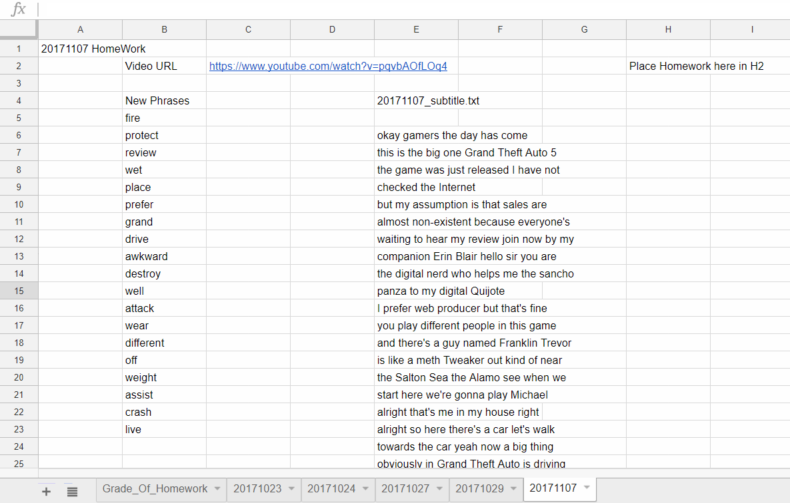

# Giving english homework using youtube video

This is script written to give homework to my english student.

Works following the steps listed

 * Download .srt file from downsub.com
 * Parse it and find the Phrases that is both in the srt file, and your wordlist(wordlist.txt)
 * Post the new phrases and the texts in srt file at google drvie worksheet
* You should list the url of the videos you will use in url.txt
* The youtube video **must have subtitles/close caption**

Following is the pre-req for this script

 * [gspread](https://github.com/burnash/gspread)
 * [chromedriver](https://sites.google.com/a/chromium.org/chromedriver/downloads) - it has to be placed in the same folder with the script

You can run it by
```
python giveHW.py
```

It will work like the screenshot below


Thanks.
